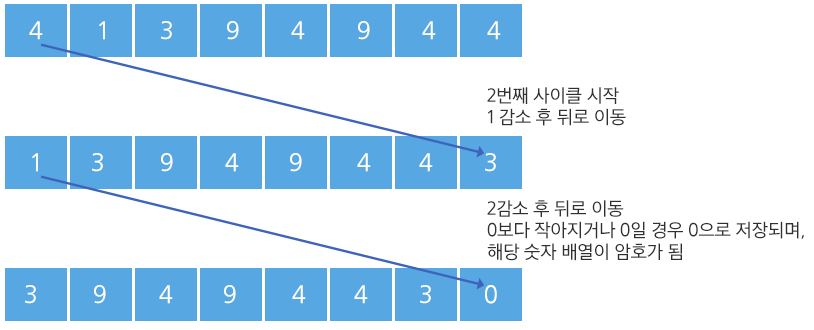

# 1225

### 암호생성기

##### 문제

다음 주어진 조건에 따라 n개의 수를 처리하면 8자리의 암호를 생성할 수 있다.

\- 8개의 숫자를 입력 받는다.

\- 첫 번째 숫자를 1 감소한 뒤, 맨 뒤로 보낸다. 

다음 첫 번째 수는 2 감소한 뒤 맨 뒤로, 그 다음 첫 번째 수는 3을 감소하고 맨 뒤로, 그 다음 수는 4, 그 다음 수는 5를 감소한다.

이와 같은 작업을 한 사이클이라 한다.

\- 숫자가 감소할 때 0보다 작아지는 경우 0으로 유지되며, 프로그램은 종료된다. 이 때의 8자리의 숫자 값이 암호가 된다.

[1 사이클] 

	


 [암호 도출]

	


##### 제약사항

주어지는 각 수는 integer 범위를 넘지 않는다.

마지막 암호 배열은 모두 한 자리 수로 구성되어 있다.


##### 입력

각 테스트 케이스의 첫 줄에는 테스트 케이스의 번호가 주어지고, 그 다음 줄에는 8개의 데이터가 주어진다.

```
1
9550 9556 9550 9553 9558 9551 9551 9551
2
2419 2418 2423 2415 2422 2419 2420 2415
........
```


##### 출력

\#부호와 함께 테스트케이스의 번호를 출력하고, 공백 문자 후 테스트 케이스의 답을 출력한다.

```
#1 6 2 2 9 4 1 3 0
#2 9 7 9 5 4 3 8 0
.......
```


##### 코드

```python
import sys
sys.stdin = open('input.txt')

def code(data):
    while True:
        for j in range(1, 6):       # 5번의 동작이 한 사이클
            x = data.pop(0)         # queue에서 첫번째 값을 꺼내서
            if x-j > 0:             # 1~5를 뺀 값이 0 보다 크면
                data.append(x-j)    # 뺀 값을 뒤로 이동
            else:                   # 1~5를 뺀 값이 0 이하면
                data.append(0)      # 뒤에 0을 저장하고
                return data         # queue를 반환

T = 10

for _ in range(1, T+1):
    test_case = int(input())
    data = list(map(int, input().split()))

    print('#{}'.format(test_case), *code(data))
```

- queue의 성질을 이용하는 문제
- deQueue는 첫번째 값이므로 `pop(0)`, enQueue는 마지막 값이므로 `append` 를 사용

- 반복문은 감소한 숫자가 0이하인 순간 종료 되고 한 사이클씩 돌기때문에
  숫자가 0 이하인 경우를 위해 while문, 한 사이클씩 도는 경우를 위해 for문으로 접근

  : 반복문의 종료는 2중 반복문 안에서 되어야 하므로 함수를 생성해 return으로 종료시키는 방법 사용