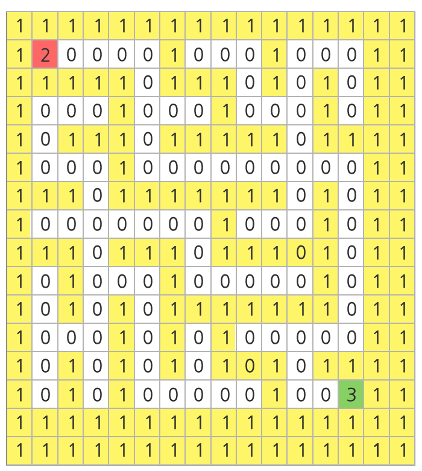

# 1226

### 미로1

##### 문제

아래 그림과 같은 미로가 있다. 16*16 행렬의 형태로 만들어진 미로에서 흰색 바탕은 길, 노란색 바탕은 벽을 나타낸다.

가장 좌상단에 있는 칸을 (0, 0)의 기준으로 하여, 가로방향을 x 방향, 세로방향을 y 방향이라고 할 때, 미로의 시작점은 (1, 1)이고 도착점은 (13, 13)이다.

주어진 미로의 출발점으로부터 도착지점까지 갈 수 있는 길이 있는지 판단하는 프로그램을 작성하라.

아래의 예시에서는 도달 가능하다.



아래의 예시에서는 출발점이 (1, 1)이고, 도착점이 (11, 11)이며 도달이 불가능하다.


##### 입력

각 테스트 케이스의 첫 번째 줄에는 테스트 케이스의 번호가 주어지며, 바로 다음 줄에 테스트 케이스가 주어진다.

총 10개의 테스트케이스가 주어진다.

테스트 케이스에서 1은 벽을 나타내며 0은 길, 2는 출발점, 3은 도착점을 나타낸다.

```
1
1111111111111111
1210000000100011
1010101110101111
1000100010100011
1111111010101011
1000000010101011
1011111110111011
1010000010001011
1010101111101011
1010100010001011
1010111010111011
1010001000100011
1011101111101011
1000100000001311
1111111111111111
1111111111111111
2
1111111111111111
1200000010000011
1011111011111011
1000001010000011
1110101010111011
1010101010100011
1011111010111111
1000001010000011
1011101011111011
1010101010000011
1010101010111111
1010100000130011
1010111111111011
1000000000000011
1111111111111111
1111111111111111
...
```


##### 출력

\#부호와 함께 테스트 케이스의 번호를 출력하고, 공백 문자 후 도달 가능 여부를 1 또는 0으로 표시한다 (1 - 가능함, 0 - 가능하지 않음).

```
#1 1
#2 1
...
```


##### 코드

```python
import sys
sys.stdin = open('input.txt')

def route(x, y):
    global result
    # 상, 우, 하, 좌
    dx = [-1, 0, 1, 0]
    dy = [0, 1, 0, -1]

    for k in range(4):
        nx = x + dx[k]                          # 다음 x좌표 nx
        ny = y + dy[k]                          # 다음 y좌표 ny
        if nx in range(N) and ny in range(N):   # 다음 좌표가 미로안의 범위일 때
            if maze[nx][ny] == 3:               # 도착점에 도착하면
                result = 1                      # 결과값을 1로 바꾸고
                return result                   # 결과값 반환
            elif maze[nx][ny] == 0:             # 아직 가지 않은 길이라면
                maze[nx][ny] = 1                # 1로 값을 바꿔 다시 가지 않게끔하고
                route(nx, ny)                   # 다음 좌표를 기준으로 재귀 실행

T = 10
for _ in range(1, T+1):
    test_case = int(input())
    N = 16
    maze = [list(map(int, input())) for _ in range(16)]

    result = 0
    route(1, 1)
    print("#{} {}".format(test_case, result))
```

- 재귀를 활용하여 접근
- 아직 가지 않은 길인 곳으로 접근하여 함수를 재귀적으로 실행하여 미로를 탐색함
  : 막다른 곳일 경우, 모든 k에 대하여 `maze[nx][ny]` 의 값이 1이므로 (지나온 곳도 1로 값이 바뀌었음)
    재귀를 실행시키지 않고, 이전좌표로 돌아가 다음 k 값을 기준으로 실행 → 갈림길으로 되돌아감

- 이런 방식으로 길을 따라가다 도착점에 도착하면 result를 1로 바꾸고 반환함
  : 도착점에 도착하지 못하는 경우 함수는 반환값이 없고, global 변수인 result의 값을 받아와 0을 출력함