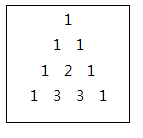

# 2005

### 파스칼의 삼각형

##### 문제

크기가 N인 파스칼의 삼각형을 만들어야 한다.

파스칼의 삼각형이란 아래와 같은 규칙을 따른다.

1. 첫 번째 줄은 항상 숫자 1이다.

2. 두 번째 줄부터 각 숫자들은 자신의 왼쪽과 오른쪽 위의 숫자의 합으로 구성된다.

N이 4일 경우,





N을 입력 받아 크기 N인 파스칼의 삼각형을 출력하는 프로그램을 작성하시오.


##### 제약사항

파스칼의 삼각형의 크기 N은 1 이상 10 이하의 정수이다. (1 ≤ N ≤ 10)


##### 입력

가장 첫 줄에는 테스트 케이스의 개수 T가 주어지고, 그 아래로 각 테스트 케이스가 주어진다.

각 테스트 케이스에는 N이 주어진다.

```
10
1
2
3
4
........
```


##### 출력

각 줄은 '#t'로 시작하고, 다음 줄부터 파스칼의 삼각형을 출력한다.

삼각형 각 줄의 처음 숫자가 나오기 전까지의 빈 칸은 생략하고 숫자들 사이에는 한 칸의 빈칸을 출력한다.

(t는 테스트 케이스의 번호를 의미하며 1부터 시작한다.)

```
#1
1 
#2
1 
1 1 
#3
1 
1 1 
1 2 1 
........
```


##### 코드

```python
import sys
sys.stdin = open('input.txt')

T = int(input())
pascal = []	

for test_case in range(1, T+1):
    N = int(input())
    line = [0 for _ in range(N)]			

    # N번째 줄 구하기
    for i in range(0, N):
        if i == 0:
            line[i] = 1                     # 1 첫번째 숫자는 1
        elif i == N - 1:
            line[i] = 1                     # 3-1 마지막 숫자는 1
            tmp = line[::]                  # 3-2 N+1번째 줄을 구하기 위해 tmp에 line을 저장
        else:
            line[i] = tmp[i - 1] + tmp[i]   # 2 i번째 값은 이전 줄(tmp)의 i-1 값 + i 값
    pascal.append(line)                     # 4 기존의 파스칼의 삼각형에 N번째 줄 추가

    print('#{0}'.format(test_case))
    for i in range(N):
        for j in range(i+1):
            print(pascal[i][j], end=' ')
        print()
```

- N-1번째 파스칼의 삼각형에 N번째 줄을 더해 N번째 파스칼의 삼각형을 구하는 방식으로 접근
  : `pascal.append(line)`
- N번째 라인을 구하기 위해선 N-1번째 라인이 필요
  : N번째 라인을 구할때, tmp에 N번째 라인을 저장해 N+1번째 라인을 구할 때 사용
  : `tmp = line[::]`이라는 표현으로 주소값을 공유하지 않고 독자적인 tmp로 저장