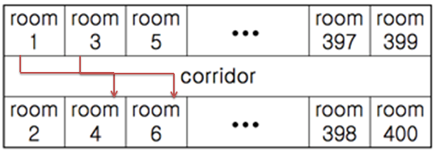

# 4408

### 자기방으로 돌아가기

##### 문제

고등학교 학생들이 학교에서 수련회를 갔다. 수련회에 간 학생들은 친구들과 음주가무를 즐기다가 밤 12시가 되자 조교들의 눈을 피해 자기방으로 돌아가려고 한다.

제 시간에 자기방으로 돌아가지 못한 학생이 한 명이라도 발견되면 큰일나기 때문에 최단 시간에 모든 학생이 자신의 방으로 돌아가려고 한다.

숙소는 긴 복도를 따라 총 400개의 방이 다음과 같이 배열되어 있다.



모든 학생들은 현재 위치에서 자신의 방으로 돌아가려고 하는데, 만약 두 학생이 자기방으로 돌아가면서 지나는 복도의 구간이 겹치면 두 학생은 동시에 돌아갈 수 없다.

예를 들어 (방1 -> 4) 와 (방3 -> 6) 은 복도 구간이 겹치므로 한 사람은 기다렸다가 다음 차례에 이동해야 한다. 이동하는 데에는 거리에 관계없이 단위 시간이 걸린다고 하자.

각 학생들의 현재 방 위치와 돌아가야 할 방의 위치의 목록이 주어질 때, 최소 몇 단위시간만에 모든 학생들이 이동할 수 있는지를 구하시오.


##### 입력

입력은 T(≤10)개의 테스트 케이스로 되어 있다. 각 테스트 케이스의 첫 줄에는 돌아가야 할 학생들의 수 N이 주어진다.

다음 N 줄에는 각 학생의 현재 방 번호(≤400)와 돌아가야 할 방의 번호(≤400)가 주어진다. 주어지는 2N개의 방 번호 중 중복되는 것은 없다.

```
3			// T : 테스트케이스 수
4  			// N : 돌아가야 할 학생들의 수
10 20 		// 10 : 현재 방, 20 : 돌아갈 방
30 40
50 60
70 80
2 			// 두번째 테스트케이스의 N
1 3
2 200
3
10 100
20 80
30 50
```


##### 출력

테스트 케이스 T에 대한 결과는 “#T ”을 찍고, 각 테스트 케이스마다 필요한 시간을 한 줄에 하나씩 출력한다.

```
#1 1	// Test Case 1의 정답
#2 2	// Test Case 2의 정답
#3 3	// Test Case 3의 정답
```


##### 코드

```python
import sys
sys.stdin = open('input.txt')

T = int(input())

for test_case in range(1, T+1):
    N = int(input())
    # 2개의 방이 같은 선상에서 출발하므로 200개의 방으로 범위설정
    room = [0 for _ in range(201)]

    for i in range(N):
        point = list(map(int, input().split()))
        '''
         숫자가 작은곳을 시작점, 큰곳을 도착점으로 설정하고
         1,2 / 3,4 / ... 식으로 같은 선상의 방 2개를 하나로
        '''
        start = (min(point) +1) // 2
        end = (max(point) + 1) // 2

        for j in range(start, end + 1):
            room[j] += 1

    print('#{} {}'.format(test_case, max(room)))
```

- 방에서 방을 이동하는 데에는 거리에 관계없이 단위 시간이 걸리고
  구간이 겹치면 다음 차례 즉, 단위 시간이 더 걸리므로
  이동할 때마다 start에서 end까지 모든 방에 +1 (단위시간)을 하여 가장 큰 값을 구하면 된다.

- 문제의 그림을 보면 room 1과 room 2는 같은 선상에 있으므로 같은 출발점이라고 생각한다.

  : 따라서 LIST room은 200개의 값을 갖는다.
  : start 와 end 는 `(point + 1) // 2`  로 room 1, room2 는 1, room2,  room3 는 2  … 의 값을 갖는다.

- 출발점은 작은값, 도착점은 큰값으로 고정해 반복문에서의 예외를 없앤다. 